# Lab. 3: CRM EN ODOO

## Desarrollo

###1. Inicio del Software Odoo

1.1. Mostramos la pantalla de aplicaciones **Odoo**

**2. Instalación del Módulo CRM**

2.1. Localizamos el Modulo CRM

2.2. Instalamos dicho módulo
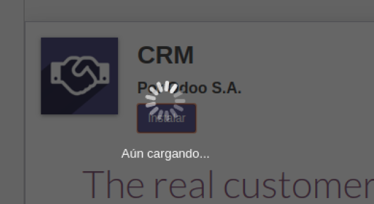

2.3. Hacemos click en dicho módulo para visualizar sus opciones
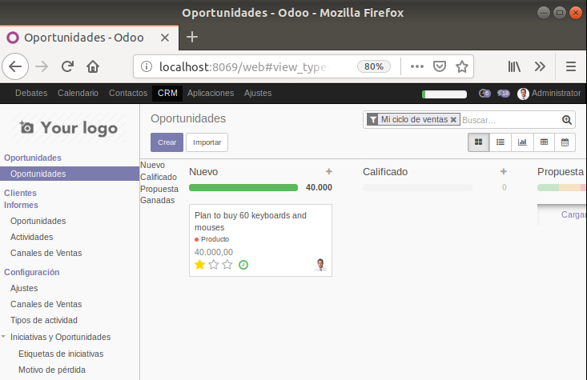

**3. Configuración ODOO CRM - Planificador de ventas**

3.1. Hacecmos click en la barra de progreso para mstrar el asistente de configuracion del módulo
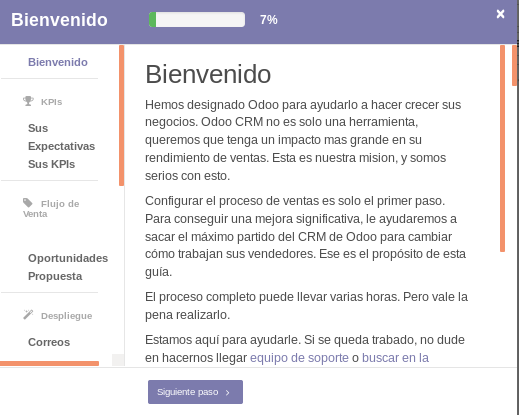

3.2. Ingresamos las expectativas de su estrategia (Objetivos de ventas, retos)
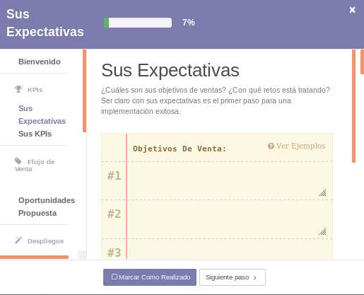

3.3. Ingresamos los KPIs de nuestra estrategia:
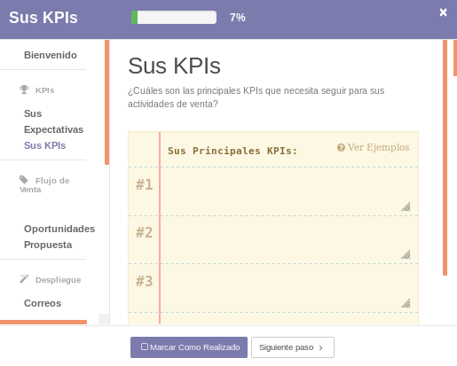

3.4. Configuramos las oportunidades para nuestra estrategia:
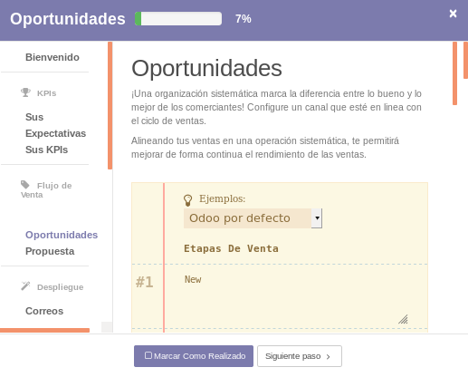

3.5. Configure el tipo de propuesta de venta de productos o servicios:
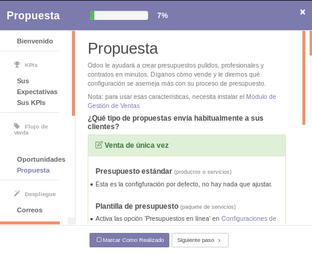

3.6. Revisamos las recomendaciones de la ventana: **“Correos electrónicos entrantes”**:
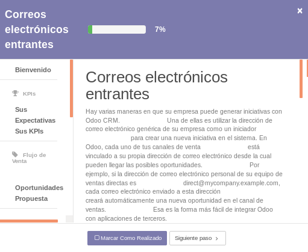
Revisamos además las recomendaciones al final de la ventana anterior: 
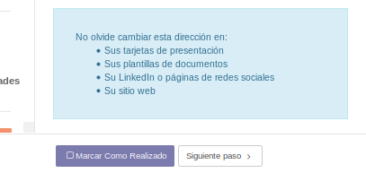

3.7. Revisamos las opciones disponibles para creación de **Clientes**
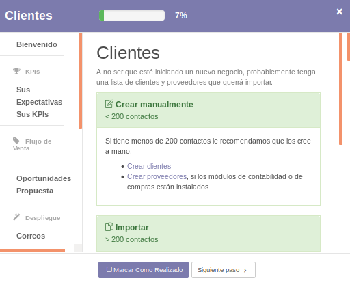

 3.8.  Revisamos las opciones disponibles para creación de **Productos**
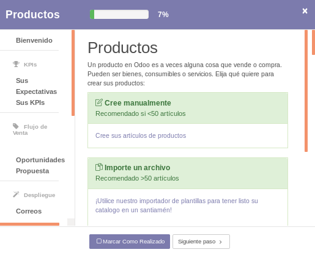

3.9. Revisamos las opciones disponibles para definición de **Precios & descuentos**
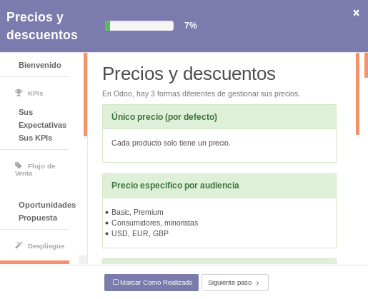

Observamos las acciones sugeridas al final de la página:
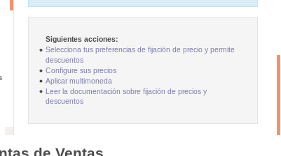

3.10. Revisamos las opciones disponibles para definición de **Informes**
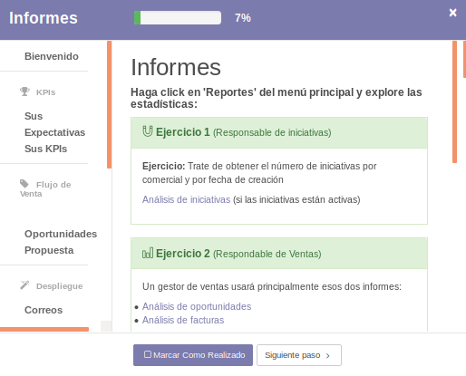
Observamos las acciones sugeridas al final de la página:
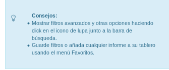

3.11. Revisamos las opciones disponibles para **Personalizaciones** 
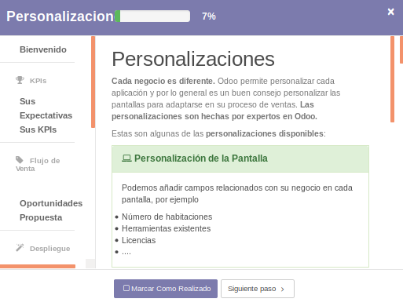

3.12. Revisamos las opciones disponibles en **“Reuniones Semanales”**
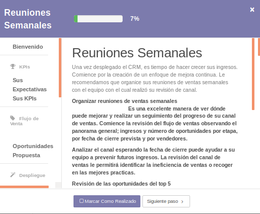

3.13. Revisamos las opciones disponibles en **“Herramientas de Ventas**
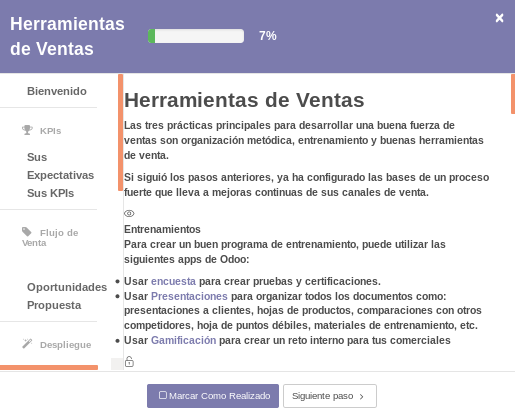

3.14. Finalmente el asistente muestra la pantalla de finalización:
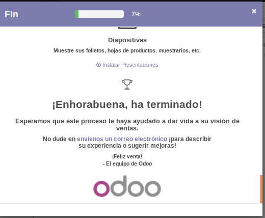

**4. Configuración ODOO CRM - Clientes**

4.1. Clic en la opción **Clientes** del **Tablero**
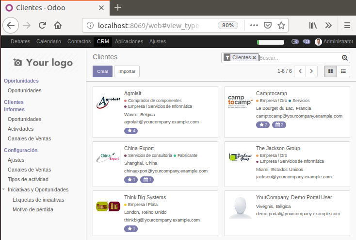

4.2. Creamos un nuevo **Cliente**
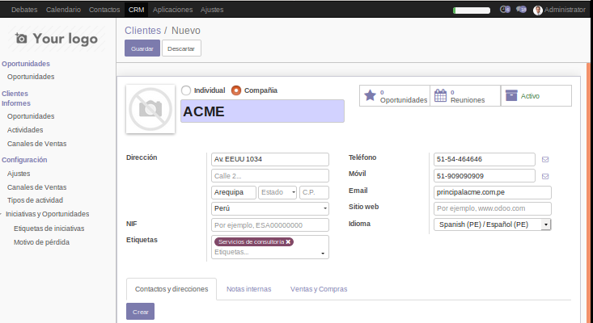

4.3. Le adicionamos un nuevo contacto:
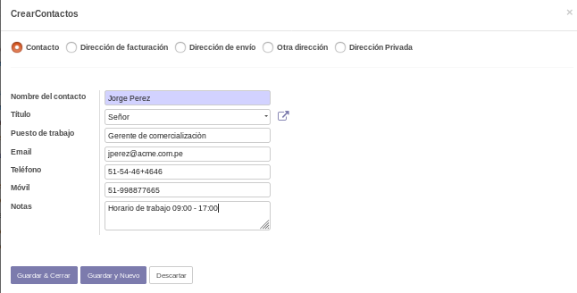

4.4 Elegimos un archivo para que sea su imagen

4.5 Guardamos el nuevo Cliente
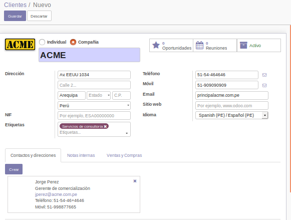

4.6 Cargamos la lista de todos los clientes y verificamos que existe el que acabamos de crear:
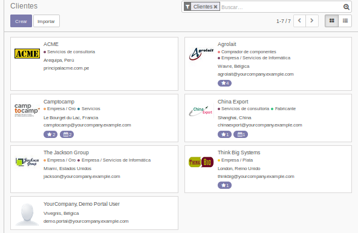

**5. Equipo de Ventas - Equipo de ventas directas**

5.1. Clic en la opción del tablero Canales de Ventas
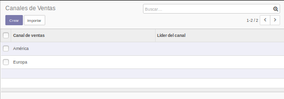

5.2. Clic en la Opcion de América
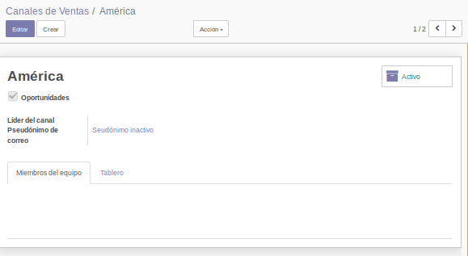

5.3. Clic en **Editar** y agregamos un nuevo **Miembro de Equipo**. Clic en el boton **Agregar**
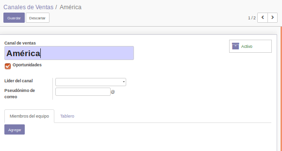

5.4. Clic en el botón **Crear** para agregar un nuevo miembro a la lista
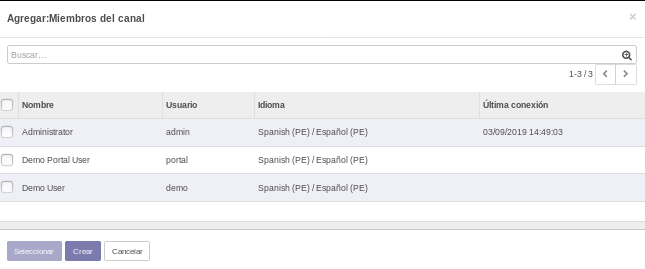

5.5. Completamos los datos del nuevo miembro del equipo. Clic en **“Guardar y Nuevo”** para finalizar
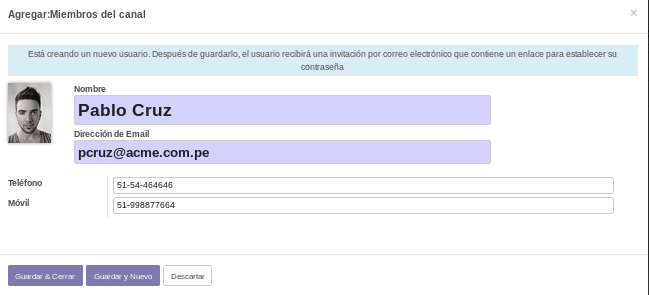

5.6. Aplicando el procedimiento anterior, adicionamos un segundo miembro al equipo
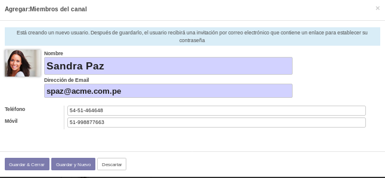

5.7. Aplicando el procedimiento anterior, adicionamos un tercer miembro al equipo
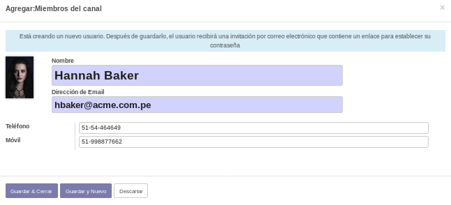

5.8. Verificamos que tengamos creados los tres nuevos miembros del equipo:
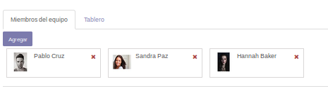

5.9. Elegimos a Hannah Baker, como Jefe de equipo y hacemos clic en **Guardar** para finalizar la creación de los miembros del equipo:
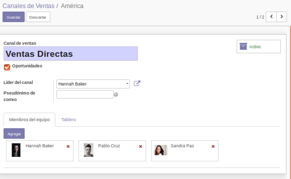

5.10. Visualizamos nuevamente los **“Canales de Ventas”** y verificamos que el equipo de Ventas Directas tiene asignado un jefe de equipo: 
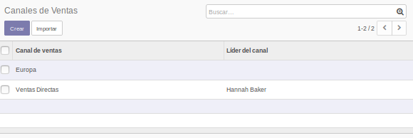

**6. Iniciativas y/o oportunidades en ODOO (Leads)**

6.1. Vamos a **Ajustes** y activamos el estado de Iniciativas, luego clic en **Aplicar**
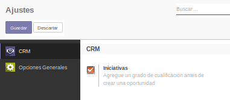

6.2. Verificamos que se haya creado un nuevo submenú Iniciativas que le da acceso a una lista de todos sus iniciativas en la cual será capaz de crear un nuevo contacto
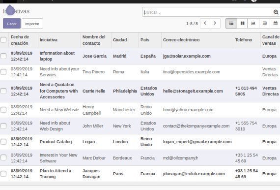

6.3. Para crear un nuevo **Contacto** ir a **Iniciativas** y hacer clic en el botón **Crear**.
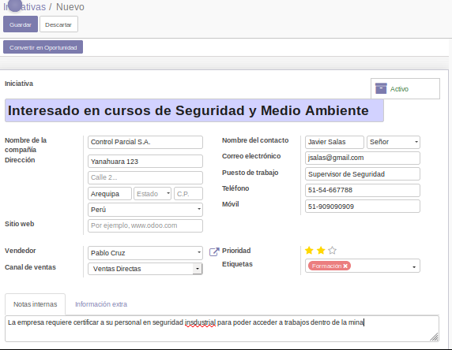

6.4. Luego clic en el botón **Convertir en oportunidad**
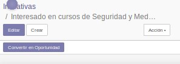

6.6. En el cuadro de diálogo de confirmación, Clic en el botón **“Crear oportunidad”**
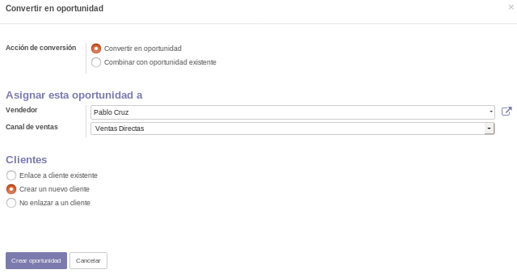

6.7. Verificamos en la opción de **Clientes** que se muestra el nuevo **Contacto** generado:
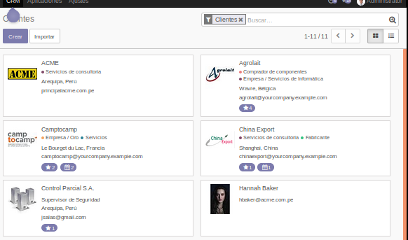

6.8. Verificamos en la opción de Flujo de Ventas (Vista Kanban) que se muestra el nuevo **Contacto** generado:
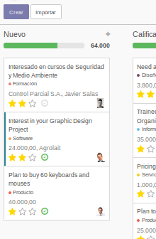

6.9. Cambie de la vista **Kanban** a la vista de **Lista** y ubique el nuevo Contacto generado 
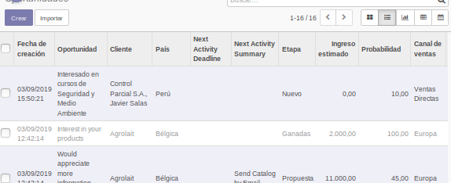

**Crear una nueva oportunidad**

6.10. En el tablero active la vista **Kanban** y clic en **Crear**. Ingrese los datos del nuevo **Cliente**:
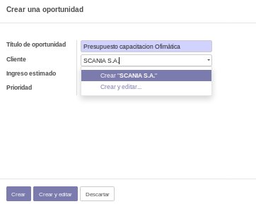

6.11. A continuación se muestra los datos del nuevo **Cliente** y los datos de un **nuevo contacto** asociado al cliente, clic en **Crear** y complete el formulario:
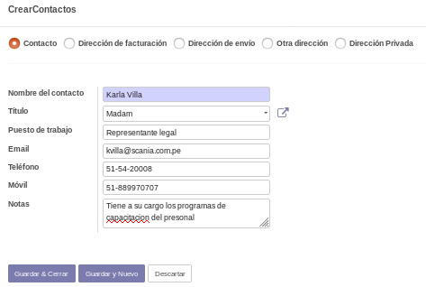

6.12. Clic en el botón **Guardar** para grabar el nuevo **Cliente**
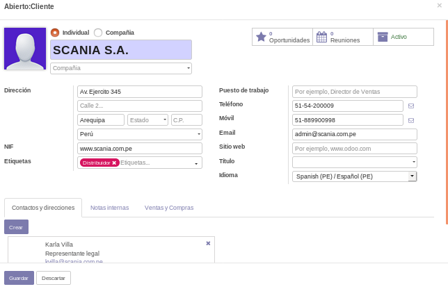

6.13. Complete los datos de **Ingreso estimado** y **Clasificación**. Clic en el botón **Crear**
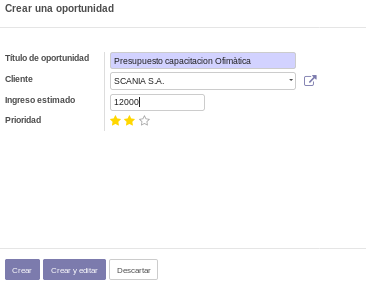

6.14. Verificamos que en la vista **Kanban** se muestre la nueva **oportunidad** creada
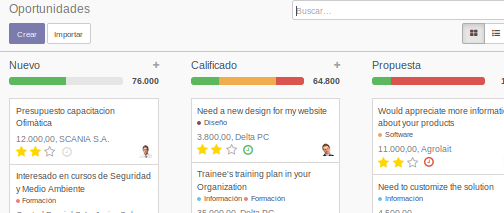

**7. Generar iniciativas desde el sitio web de ODOO**

7.1. Instalar el módulo **“Website Builder”**
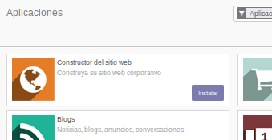

7.2. Elija un tema, por ejemplo **“bootswatch”**
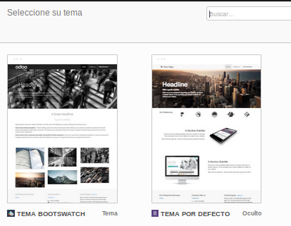

7.3. Clic en **Edit**
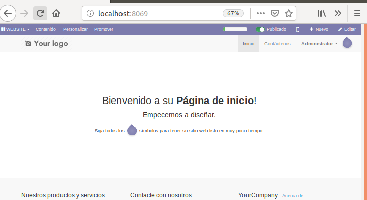

7.4. Adicione el elemento **Cover** y configuramos la visualización del nuevo Cover como se indica en la figura y clic en **Guardar**:

7.5. Regresamos nuevamente al panel Apps con la opción del menú Website indicado e instalamos el módulo **"Formulario de Contacto"**.

7.6. Verificamos que se haya adicionado el siguiente formulario de contacto a su sitio web en el enlace correspondiente a **Contáctenos**. Adicionamos un nuevo Contacto empleando el formulario anterior. Clic en **Enviar**

7.7. Debemos visualizar un mensaje de confirmación de la creación del contacto:

7.8. Regresamos nuevamente al módulo **CRM**. Elija la opción del tablero **Ventas → Iniciativas** y verifique que se muestre el nuevo contacto captado por medio del sitio web 

7.9. Seleccione la nueva iniciativa en el panel anterior y elija la **Acción → Convertir a oportunidades**. Complete los datos del formulario y clic en **Convertir a Oportunidades**

7.10. Elija la opción **“Oportunidades”** y verifique que se visualiza la nueva oportunidad:

7.11. Desplace la nueva oportunidad a la columna **“Calificado”**

7.12. Aplicando el ejercicio anterior crear 2 nuevas oportunidades empleando el formulario de contacto (adjunte imágenes de los datos ingresados en el formulario contáctenos, adjunte imágenes de la vista Kanban donde se visualicen las 2 nuevas oportunidades) 

Generamos los dos contactos:

Los visualizamos en la **Lista**

Los desplazamos a **Calificado**

## Tarea

- Describa el procedimiento para importar contactos/clientes desde un archivo CSV (revise la documentación)

1.1. Exportamos dos Clientes, con los Datos Nombre, Telefono y Email. El ID ses adicionara por defecto. Todo en formato CSV (todo ello sera para no tener que crear al archivo de cero, al menos ya tendremos las cabeceras)

1.2. Visualizamos nuestro archivo CSV, cambiamos a los datos que queremos importar.

1.3. Hacemos clic en Importar en la vista de la Lista. En la ventana Importar un Archivo, hacemos clic en  Cargar fichero, escogemos nuestro CSV

1.4. Le damos en Probar importacion para verificar que todo este correcto.

1.5. Una vez obtenido el mensaje de que todo esta OK, hacemos clic en Importar.

1.6. Visualizamos en la Lista los datos importados.

- Mejore la presentación del módulo Website instalado adicionando mayor cantidad de elementos disponibles en su editor. Adjunte imágenes del resultado obtenido.

CAPTURAS:

## Observaciones

- Al parecer el tutorial del laboratorio corresponde a la version 8, actualmente trabajamos con la version 11 y podemos notar que existe varios cambios de esta version (8) a la usada(11).
- Como fotos de contacto o imagenes, podía cargar GIF's y normal se mostraban en Odoo.
- Con la nueva actualizacion existen mas campos en los formularios vistos en el laboratorio.
- Al instalar un nuevo módulo, Odoo nos da una breve introduccion acerca de las herramientas y funcione que tiene este.
- Dentro de los canales de Ventas para usarlos en una iniciativa debemos de tener marcado el check de Oportunidades dentro de su formulario.

## Conclusiones

- **CRM** es la gestion de relaciones con clientes, vendría a ser una estrategia de Marketing y ventas. Es el software que las empresas utilizan para gestionar a esos clientes.
- Con el **CRM** podemos registrar cada actividad inmediatamente en el gráfico de oportunidad con acciones predefinidas.
- Dentro de Odoo podemos adicionar imagenes desde nuestro ordenador, puede ser formato PNG, JPEG, JPG.
- Las oportunidades son ordenadas por priodad (estrellas) en el Tablero Kaban, eso da una mejor vista al usuario, para saber que oportunidades le combienen.
- Con Odoo podemos crear un sitio web totalmente personalizable, podemos agregarle funciones a medida de que crezca.
