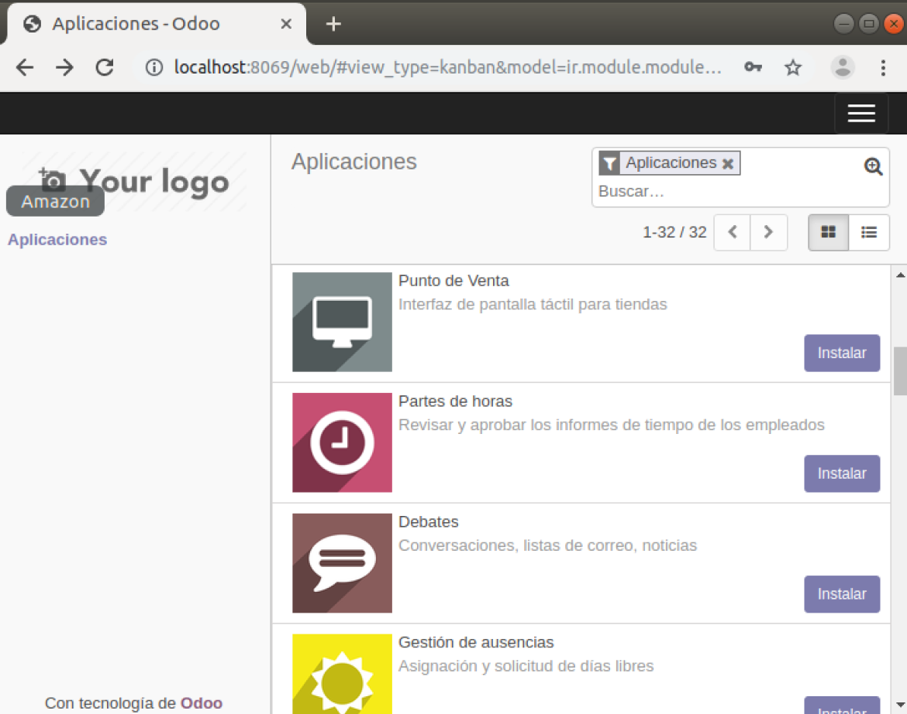
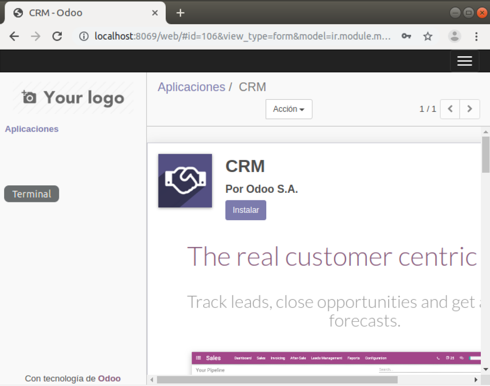

# Lab. 3: Creación de proyecto React

## Desarrollo

1.1. Inicio del software **Odoo**


2.1. Localizamos el Modulo CRM



## Tarea

- Se completó el desarrollo del laboratorio.

## Conclusiones

- **React JS** es una librería basada en componentes que nos ayuda a tener un desarrollo __ágil y completo__
- Para instalar el cliente oficial de React, basta el comando:
```
npm install --global react-cli
```
- Dentro de nuestra carpeta **src** se encontrarán todos nuestros archivos.
- Se adjunta el enlace para documentación básica de Markdown [https://guides.github.com/pdfs/markdown-cheatsheet-online.pdf](https://guides.github.com/pdfs/markdown-cheatsheet-online.pdf)