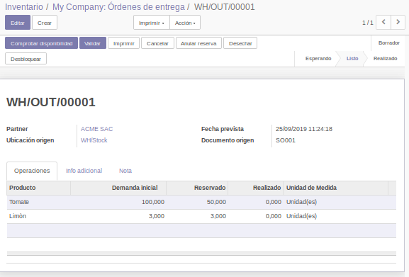
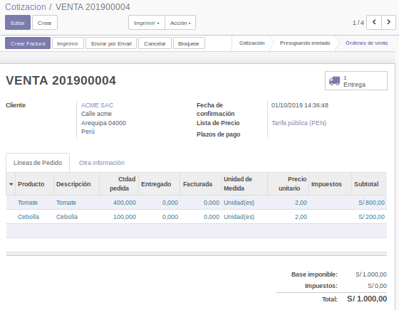

# Lab. 5: MÓDULO VENTAS EN ODOO

## Procedimiento

### 1. Instalación de Módulo Ventas.
1.1. Creamos una nueva Base de Datos

1.2. Instalamos el modulo de ventas

1.3. Vemos la vista principal del módulo de ventas

### 2. Creacion de Cotizacion a cliente

2.1. Entramos al menú Cotización y empezamos la creación de una nueva cotización.

2.2. Seleccionemos  tomates  e  intentemos  vender  100  unidades. En  caso  no  tengamos  stock suficiente, el sistema nos dará una alerta al respecto. Esto es muy útil para la persona que realiza la cotización.

2.3. A pesar de la falta de stock, crearemos la Cotización con al menos dos productos.

2.4. En la Cotización podemos cambiar datos como el cliente, fecha, plazo de pago, incluso observaciones.

2.5. Así mismo, podemos ir a la pestaña Otra informacióny modificar el almacén de donde se va a enviar la mercadería, el vendedor asignado, la fecha del pedido, etc.

2.6. Demos  click  en Guardary  luego  en Validar. Al  validar  la  cotización, aparecerán  nuevas  opciones, como Enviar por Email, Imprimiro incluso, Confirmar Venta(recordar que esta es solamente una cotización para un cliente interesado en comprar)

2.7. En  caso  el  cliente  no  tenga  un  correo  configurado,  si  intentamos  enviar  la  cotización,  nos  solicitará inmediatamente ingresar uno.

2.8. Ahora  que  hemos  ingresado  un  correo  válido  para  el  cliente  (para  las  pruebas, ingrese  un  correo personal, usaremos el correo de TECSUP más adelante), nos aparecerá un asistente de redacción del correo.Cada vez que intentamos enviar un correo de cierto documento, Odoo precarga una plantillacon texto por defecto, además de adjuntar el documento en formato PDF. Esto permite flexibilidad en el tipo de correo a enviar según el cliente deseado, e inclusive, añadir más adjuntos, digamos, uncontrato o una foto del producto.

La cotización pasa ahora a ser un Presupuesto o Pedido de Venta.

Podemos ver así mismo, las nuevas opciones, como EntregayCrear Factura

### 3. Entrega de productos de una Cotización

3.1. Si vamos al módulo de Inventarios, en el tablero principal podremos ver que ahora tenemos una Orden de Entrega. Esto es muy útilya que sin haber hecho nada, el departamento de Ventasle comunica a Logística que se debe hacer una entrega a un cliente.

Incluso, al entrar a dicha entrega (haciendo click en 1 Por hacer,  y luego entrando ala transferencia programada)veremos los botones Comprobar disponibilidad, ya que nuestra orden aún no tiene stock suficiente.

3.2. Como parte del ejercicio, y haciendo uso de lo aprendido en el laboratorio anterior, incrementa el stock de los productos seleccionados a 500 unidades, luego dale click a Comprobante disponibilidad.

3.3. Esto  confirmará  la  entrega  de  productos  al  cliente. Así  mismo,  si  vamos  (dentro  del  módulo  de Inventario)al detalle de uno de los productos, veremos que el stock tiene dos cantidades: A mano, y el previsto.El previsto tiene en cuenta los posibles descuentos de inventarios, en este caso, la venta de 100 manzanas.

3.4. Ahora que el sistema que tiene suficiente stock para entregar,  las opciones de la transferenciahan variado. Haga click en Validar.

3.5. Intente enviar dicho movimientopor correo electrónico. La primera vez que intentamos hacer esto, le pedirá  seleccionar  una  plantilla  de  impresión,  por  lo  que se  abrirá  una  ventana  con  detalles  de  la empresa. Deslícesehastael final y verá cuatro posibles plantillas de impresión. Seleccione la que más le agrade y de Guardar, para luego intentar enviar por correo nuevamente.

### 4. Facturación y registro de pagode una Cotización

4.1. Busquemos en Ventas, Cotizaciones, el documento creado hasta ahora.

4.2. Demos click en Crear Factura, para registrar un comprobante a enviar al cliente.

4.3. Se abrirá una venta que nos pregunta cómoqueremos facturar.

Si  seleccionamos  la  opción  adelanto  de  pago,  nos  pedirá  ingresar  un  porcentaje  de  cuanto  se adelantará.

Si seleccionamos pago anticipado, nos pedirá ingresemos la cantidad pagada por adelantado.

Seleccionaremos la opción Lineas a facturar y daremos click en Crear y Ver Facturas.Esto creará una factura en Borrador, aún editable, donde podremos cambiar los datos que necesitemos.

4.4. Demos  click  en  Validar.  Al  igual  que  con  otros  documentos,  aparecerán  nuevas  opciones  en  esta factura.Podremos incluso crear un correo con el adjunto de la factura generada para pagar.

4.5. Al  haber  validado  esta  factura,  se  afectará  al  estado  del  cliente. Si  buscamos  en  el  menú  Clientes, veremos que nuestro contacto ahora tiene un indicador de cuantas ventas tiene.

Al entrar al contacto, vemos el total facturado hasta el momento a dicho cliente.

E  incluso,  al  hacer  click  en  Imprimir,  tendremos  un  reporte  llamado  Pagos  pendientes,  que  muestra todo el detalle de deuda del cliente.

4.6. Volvamos a la factura. Ahora demos click en Registrar Pago.Por defecto, se completa el monto para toda la factura y darla por cancelada.

En  caso,  nos  vayan  a  hacer  un  pago  parcial,  ingresamos  la  cantidad  abonada.El  sistema  se  dará cuenta  de  esto  y  nos  preguntará  si  debe  mantener  aún  abierta  la  factura  o  pagarla  totalmente. La dejaremos abierta y validaremos el pago.

Si  vemos  el  detalle  de  la  factura,  en  la  parte  de  los  totalesveremosregistrado  el  pago  y  el  saldo pendiente de pago.

Esto  también  podremos  observarlo  en  el  módulo  de  Facturación,  al  ver  el  comprobante  en  estado abierto y cuáles el saldo pendiente.

### 5. Configuración de envío de Correos

5.1. Hasta ahora, ha enviado dos correos pero no deben haber llegado a su bandeja. Esto es porque Odoo utiliza un servidor smtp de correo y nosotros debemos configurarlo.Activemos el modo Desarrollador. Luego vamos al menú Ajustes, Técnico, EmailyServidores de correo saliente.Por ahora solamente existe un servidorde correo saliente. Lo seleccionaremos.

5.2. De click en Editar para modificar el servidor de correo. Ingresaremos la siguiente data. Reemplace el correopor el suyo propio de Tecsup y coloque la contraseña que utiliza para iniciar sesión.

Si hizo esto, e intentó dar click en Probar conexión, verá que rechaza su solicitud. Esto es debido a una protección por defecto de Gmail. Vamos a deshabilitarla.

5.3. Vamos a la  [URL](https://myaccount.google.com/security) y  deslicemos la  pantalla  hasta  la  opción  de Acceso de aplicaciones poco seguras.Demos click en Activar acceso.

Ahora, solamente debemos permitir el acceso a estas aplicaciones.

Una vez hecho esto, volvamos a Odoo y probemos la conexión. En caso de ser exitoso, demos click en Guardar.

5.4. Intentemos nuevamente enviar una factura a algún cliente. La razón por la queen el laboratorio se solicitó  que  al  cliente se coloque  un  correo  personal  y  no  el  de  Tecsup,  es  que Odoo  no  envía correos si es el mismo correo del usuario que intenta enviarlo.

### 6. Cambio de secuencia.

6.1. Nuestra  cotización  se  creó  como  la SO001. Esta  es  una  secuencia  interna  de  Odoo  y  podemos modificarla. Estando  aún  en  modo Desarrollador,  vamos  a  Ajustes, Técnico,  Secuencias  e Identificadores, y finalmente, Secuencias.

6.2. En el buscador escribiremos la palabra sale, para ubicar nuestra secuencia de sales order. Una vez encontrada, demos click en ella.

6.3. Modificaremos la secuencia para que tenga la siguiente forma. Fíjese que estamos usando la notación de años indicada en la parte inferior yaumentamos el tamaño de la secuencia a 5.

6.4. Guardelos cambios de la secuencia y cree otra Cotización. Verá el cambio rápidamente reflejado.Así podemos modificar todas las secuencias del sistema, no solamente las de ventas.

### 7. Listas de precios

7.1. Vamosa explorar las listas de precios. Para esto, debemos ir al módulo Ventas, Ajustes y activar la opción Múltiples precios de venta por producto.

7.2. Ahora tendremos habilitado un Menúde Listas de precios. Cree una lista llamada Tarifa Mayoristas.

Podrá ver como en el detalle del producto, la pestaña de Ventas cambia para poder ingresar el precio de acuerdo a la lista. Modifiquemos la manzana verde para que tenga los precios indicados.

7.3. Proceda  a  crear  otra  cotización  y  juegue  con  el  cambio  de  Lista  de  Precio  (este  campo  no  estaba activado antes)

7.4. Así mismo, si intenta editar un cliente, verá que en la pestaña Ventas  y Compras, ahora aparecerá una  opción  de Lista  de  precios  de  venta. Esto  significa  que  puedo  otorgar  ciertos  precios  a  ciertos clientes segúnsea necesario.

7.5. Solamente comoadición, si volvemos a Ajustes y vemos la opción de Múltiples precios, vemos que podemos incluso modificar esto para que obedezcan a fórmulas. Activemos esta opción.

Al entrar a la tarifa, veremos unos ítemsde lista de precios. Esta es una forma avanzada de cálculo de precios,  que  permite manejar  descuentos,  importes  fijos,  fechas  de  inicio  o  fin,  márgenes  e  incluso, aplicar solamente sobre cierto producto o categoría de productos.

### 8. Portal del cliente

8.1. Fíjese que,por defecto, en Ajustes de Ventas, está seleccionada la opción Con invitación de Cuenta de cliente.Esto sirve para mandar invitaciones al cliente y que pueda ver un portal con el detalle de sus pedidos.

8.2. Vamos al detalle del Cliente y damos click en Acción, luego en Administración de acceso al portal.

8.3. Le  diremos  al  sistema  que  este  cliente  tiene  acceso. De  click  en  el  check  al  costado  del  correo electrónico para poder marcarlo y activarlo.

8.4. Esto habrá enviado un mensaje al correo antes ingresado.

8.5. Haremos  click  en  el  enlace  que  menciona  el  correo  para  poder  establecer  nuestra  contraseña  de cliente.

8.6. Finalmente tendremos acceso al portal del cliente.

Aquí podremos ver las facturas o pedidos realizados.

8.7. Así  mismo el  cliente  tendrá  incluso  la  opción  de  actualizar  sus  propios  datos,  ayudándonos  en  la validación de información del sistema.

## TAREA

- Crear una  cotización,  validarla  y registrar  una  factura  por  pago  previo  (La  cotización  será  de S/1000.00 y la primera factura será de S/200.00, la otra por el restante)

- Adjunte una captura del proceso, de cómoverá el cliente mediante su portal web a la factura, al inicio de seremitida, luego del primer pago,y finalmente cuando está pagada totalmente.

## OBSERVACIONES
- Al instalar el modulo de ventas era necesario tener el modulo de inventario para tener productos almacenables.
- No podia generar documentos PDF en Odoo ya que no tenia la herramienta WKHTMLTOPDF, se tuvo que instalar por terminal en Ubuntu 18, con comandos en la terminal, los cuales estan en el siguiente [enlace](https://www.odoo.com/es_ES/forum/ayuda-1/question/ubuntu-18-04-lts-how-to-install-wkhtmltopdf-0-12-1-recommended-for-odoo-9-0-and-lower-134198).
- Si no ingresamos las cantidades hechas,  es decir las validadas, en entrega de Pedido, si hacemos clic en el boton Aplicar de la ventana emergente Odoo asumirá que todas las cantidades han sido entregadas.
- Es necesario permitir el acceso a aplicaciones desconocidas en Google, de lo contrario tendremos errores en la plataforma de Odoo al probar la conexion.
- No podiamos hacer el envio de los correos con el internet que nos brindaba Tecsup ya que tenia algunas funciones restringidas.

## CONCLUSIONES
- El modulo de ventas nos permite controle todos los procesos de venta en una empresa. podemos crear un presupuesto de venta pasarlo a pedido, albaranar y facturar, de una manera rápida y sencilla​.
- El proceso de ventas en Odoo tiene fases: Cotizacion, Presupuesto enviado y Orden de Venta.
- A partir de una Orden de Venta ya podemos crear las entregas y las facturas.
- El modulo de Ventas esta integrado con las aplicaciones: CRM, Firma electronica, Creador de sitios web y Contabilidad.
- Se puede crear una venta sin stock pero al momento e hacer a entrega de esa venta tendremos que aumentar si o si de Stock.
- El cliente tambien tiene su propio portal para poder ver sus facturas y sus pedidos, dentro de este portal puede ver el estado y el detalle de las facturas y pedidos. Y en caso de que no lo hayamos registrado bien, el cliente puede autocompletar sus datos.