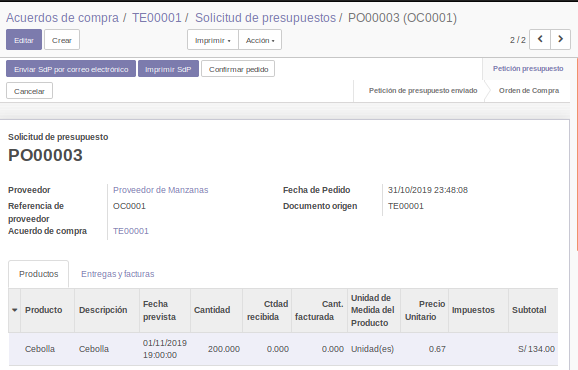

# Lab. 6: MÓDULO COMPRAS EN ODOO

## Desarrollo

### 1. Instalación de Módulo Comrpras.
1.1. Creamos una nueva Base de Datos

1.2. Instalamos el modulo de inventarios

### 2. Creación de Solicitud de presupuesto

2.1. Buscaremos la opción Solicitudes de presupuesto dentro del módulo Compras y haremos click en Crear.

2.2. La creación de  una Solicitud  de presupuesto suele ser  relativamente sencilla. Nos pedirá  los  datos básicos  como  quien  es  nuestro  proveedor,  los  productos  que  deseamos  adquirir,  sus  impuestos respectivos y el precio de compra.

2.3.Sin embargo, ya habrá notado que si intentamos escribir un precio con decimales (como en el ejemplo, que  compras  las manzanas  a  40  céntimos  la  unidad),  el  sistema  solicita  el  uso  de  la  coma  y  no  el punto   para   la   separación   decimal. Configuraremos   por   un   momento   dicho   separador   para acomodarnos a la realidad peruana (donde solemos usar el punto y nola coma).Estando  en  modo Desarrollador,  vamos  al  módulo  Ajustesy  buscamos  la  opciónIdiomas,  donde seleccionaremos el nuestro.

Al  editar  el  idioma, veremos que  podemos modificar  no solamente el separador de  decimales, sino también  el  separador  de  millares  e  inclusive  la  forma  de  visualización  del  formato  de  fecha. Modifiquemos el separador de decimales para que use el punto, y el de millares para que use la coma. Guardemos e intentemos crear otra Solicitud de presupuesto, notará la diferencia en el uso.

2.4. Podemos ver que al crear la solicitud de presupuesto se habilitan las opciones de Imprimir e incluso enviar por correo electrónico. Adjunte una imagen de cómo luce el correo en su bandeja y el adjunto generado.

2.5. Si bien faltó mencionar, las solicitudes de presupuesto sirven para planificaradquisiciones de mercadería. En las pestañas de Entregas y facturas, podemos programar la fecha prevista, el plazo de pago al proveedor, la fecha de aprobación, etc.

2.6. Validemos la Solicitud de presupuesto y veamos las nuevas opciones habilitadas. Se crea por defecto un envío (en caso tengamos productos que no sean servicios)y un botón para registro de las facturas del proveedor.

### 3. Recepción de compras

3.1. Demos click en el botón Recibir productos. Nos llevará a un formulario de transferencia (como los vistos en el laboratorio 4de este curso).

3.2. La transferencia a la que hemos llegado tiene los datos para completar toda la compra de nuestro proveedor. Hay muchos casos en que nuestro proveedor hace entregas parciales, puede ser la mitad de mercadería un día, y a la semana siguiente el resto. Odoo contempla esto, y al intentar crear una entrega parcial, nos preguntará si deseamos confirmarla o darla por completa (sin pedido pendiente).

3.3. Realice una entrega parcial y luego intente crear la segunda entrega del material solicitado. Se deberán visualizar ambas entregas en la Solicitud de Presupuesto.

### 4. Gestión de Productos

4.1. Proceda a crear una factura en la solicitud de presupuesto.Esta se creará en estado Borrador, así que podremos editar los datos importantes, como,por ejemplo, la referencia del proveedor (allí irá el número de la factura del proveedor), la fecha de factura, fecha de vencimiento, etc.Adjunte una imagen de lo que está dentro de la pestaña Otra información.Proceda luego a validar esta factura en borrador.

4.2. La factura ahora podrá ser encontrada dentro de la Solicitud de presupuesto o incluso dentro del menú de Facturación, submenú Compras, Facturas de Proveedor. Fíjese que aparece con un monto A pagarque es precisamente la deuda que tiene la empresa con el proveedor.

4.3. Si buscamos los detalles del proveedor (indique como llegó a este formulario)veremos que ahora aparece en su detalle una compra y una factura de proveedor.

Así mismo, en la pestaña Ventas y Comprasdel formulario de detalle del proveedor podremos ver la sección Pagos, donde podremos registrar una cuenta bancaria del proveedor.Registre una cuenta para dicho proveedor y adjunte una imagen del proceso de creación.

4.4. Procederemos a volver a la factura y pagarla. Al igual que en el caso de las facturas de venta, veremos cómose registra el pago en la parte inferior de la misma.

### 5. Tarifas de proveedores

5.1. Vamos a la ficha de detalle de alguno de los productos adquiridos. Veremos que automáticamente Odoo ha registrado dentro de la pestaña de Comprasel proveedor del mismo y el precio al que nos lo ha entregado. Esta información sirve para hacer una comparación rápida entre proveedores.

5.2. Procedemos a ir a Configuracióndentro del módulo de Compras y activar la opción Tarifas de compra.

5.3. Se habilitará entonces un menú de Tarifas de Compra, en el que podremos establecer distintos precios para un mismo proveedor de acuerdo a las cantidades entregadas.Adjunteuna imagen con las tarifas de un proveedor para la venta de un mismo producto por unidad, docena, ciento y una tarifa válida para las mismas cantidades pero solamente válida en navidad.

### 6. Licitaciones

6.1. Si bien ahora la solicitud de presupuesto nos ha ayudado para crear compras dirigidas, habrá empresas que inicien un proceso de licitación, es decir, empezar un concurso y escoger la compra dependiendo del mejor postor.En el menú Configuraciónde Compras, activaremos la opción Acuerdos de compra.

6.2. En el menú Acuerdo de compra, cree un nuevo proceso dando click en Crear.

6.3. El Acuerdo de compra(o licitación)es muy parecido a la Solicitud de presupuesto, con la diferencia de que desde un inicio no se indica los precios a acordar ni el proveedor seleccionado.Cree una indicando una fecha límite y una fecha de entrega posteriores a la fecha actual, ya que seránlas fechas hasta cuando los proveedores pueden enviar sus propuestas, y la fecha en que deben entregar preferiblemente sus propuestas.

6.4. Después de haber creado nuestra licitación, procedamos a Confirmarla. Veremos que se habilita la opción de crear un Nuevo Presupuesto. Estas serán las propuestas de nuestros proveedores.

6.5. Hagamos click en Nuevo Presupuesto para ingresar una propuesta. Este ingreso se parecerá mucho a la solicitud de presupuesto que ya hemos creado antes.Proceda a crear al menos dos presupuestos más ligados a este proceso.

6.6. Al volver a nuestra licitación, veremos cómo se contabilizan todas nuestras propuestas.

6.7. Valide el proceso e intente averiguar cómo elegir un ganador de este proceso. Odoo lo ayudará a elegir dicho ganador y seguir el proceso tradicional de la facturación y las entregas. Adjunte imágenes de todo lo relatado.

### 7. Módulos de terceros

7.1. Si ingresamos al [portal](https://apps.odoo.compodremos) acceder a todo el catálogo de módulos creados para Odoo. Hay todo tipo de módulo, de todo rubro, y al mismo tiempo, algunos tendrán un costo y otros serán gratuitos.

7.2. Buscaremos el módulo Top Buying Products. Escogeremos la segunda opción de la búsqueda (el resultado con el nombre tal cual hemos escrito)Estamos escogiendo este módulo ya que es uno gratuito.

7.3. Al entrar en el módulo, encontraremos su licencia, nombre técnico, descripción e inclusive las versiones para las que es compatible (encontraremos en la tienda muchos módulos compatibles con la mayoría de versiones de Odoo).Hagamos click en el botón Download for 11.0 series y procedamos a descomprimir el zip descargado.Lo descomprimiremosen una carpeta deconveniencia nuestra (por ejemplo, la carpeta llamada odoo11 dentro de nuestra unidad D). Esta carpeta será donde descomprimiremos todos nuestros módulos de terceros.Nota:Los módulos se pueden descomprimir en la ubicación de los módulos originales de Odoo, pero no es una buena práctica ya que es recomendable separar lo original de la compañía con los módulos tercerizados.

7.4. Para configurar la carpeta donde estamos poniendo nuestros módulos de terceros, deberemos hacer una modificación en la configuración de nuestro Odoo. Buscaremos en la carpeta de instalación del mismo el archivo odoo.conf(esto es válido para todo sistema operativo, busca la carpeta donde está instalado y abre ese archivo con el editor de tu preferencia, en el caso de Windows tal vez necesites abrirlo como Administrador)

7.5. Editaremos la línea con la variable llamada addons_path, le concatenaremos una coma (para separar ambas carpetas)y luego concatenaremos la ruta a nuestro directorio personalizado. Esto puede ser repetido para varias ubicaciones, Odoo no nos limita a solamente una o dos carpetas donde estén nuestros directorios. Proceda a guardar el archivo y luego reinicie el servicio de Odoo.

7.6. En modo Desarrollador, vaya al módulo de Aplicaciones, y de click en Actualizar lista de aplicaciones. Esto servirá para que Odoo pueda reconocer todo módulo nuevo en las ubicaciones antes listadas.

7.7. Ahora si, al buscar el módulo Top Buying products deberá aparecer entre nuestros módulos. Proceda a instalarlo.

7.8. El módulo que hemos seleccionado nos agrega una opción en Compras llamada Top Buying Productsque nos mostrará un asistente para poder crear un reporte de los productos más vendidos durante cierto periodo.

7.9. Busque en la tienda de Odoo el módulo Toponimos de Perú. Proceda a descargarlo e instalarlo en su Odoo local. Tenga cuidado de descargar la versión adecuada (en este caso, la versión 11). Adjunte capturas de los cambios que implementa este módulo.

Con este modulo podemos configurar las direcciones pero con las ubicaciones de Perú para Departamentos, Provincias y Distritos.

## OBSERVACIONES

- Nosotros tenemos precio de venta y precio de compra en cada Producto, lo bueno de Odoo es que usa un precio distinto si es una cotizacion usa precio de venta y si es solicitud de presupuesto usa precio de compra.

- A veces al hacer cambios en odoo.conf es necesario reinicar el servicio de Odoo, para asegurarnos de que los cambios se hicieron exitosamente.

- el archivo odoo.conf solo se puede editar con permisos de administrador, yo en mi caso he tenido que agregar todos los permisos a odoo.conf para poder editarlo.

- El modulo de Compras es muy similar al Modulo de ventas, ambos tiene presupuestos, los envian y al final confirman los pedidos para crear ordenes de entrega y facturas.

- Podemos ubicar nuestros modulos externos en cualquier carpeta, o disco, siempre y cuando pongamos la direccion correcta en addons_path.

## CONCLUSIONES

- La Orden de Compra generará una factura, y dependiendo del contrato con el proveedor, usted tendrá que pagar la factura antes o después del envío.

- Podemos crear entregas parciales, por si nuestro proveedor se quedo sin stock, al hacer eso tenemos mas de un orden de entrega. Tambien podemos crear condiciones de venta y especificar el almacen que recibira el lote de productos.

- Lo Orden de Compra solo si es confirmada nos generará Ordenes de Entrega y Facturas.

- Al recibir productos de una compra automaticamente el inventario se actualiza con la nueva llega del lote de productos. 

- El modulo de Compras esta integrado con: Ventas, Inventario y Contabilidad.