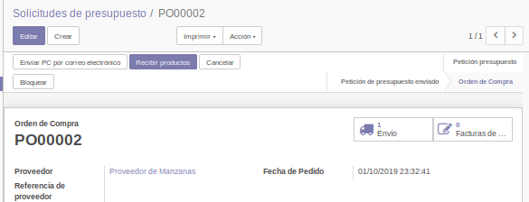
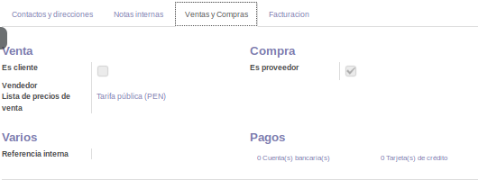

# Lab. 4: MÓDULO LOGÍSTICO EN ODOO

## Desarrollo

### 1. Instalación de Módulo Inventarios.
1.1. Creamos una nueva Base de Datos

1.2. Instalamos el modulo de inventarios

1.3. Vemos la vista principal del módulo de inventarios

### 2. Configuración de Almacenes

2.1.En la parte inferior de los menús, tendremos la Gestión de Almacenes, donde encontraremos la opción Almacenes. Hacemos click en ella.

2.2.Vemos un almacén creado llamado My Company. Este es el almacén por defecto creado por Odoo.

2.3.Vamos al menú Configuración
2.4.Ya en el menú de configuraciones, buscaremos la opción **Multialmacén** y la seleccionaremos. Luego de esto, damos click en **Guardar** en la parte superior para que el cambio sea aplicado al sistema.

2.5. Crearemos el Almacén Secundario con código SEC.

2.6. Hacemos  click  en  el  botón al  costado del  campo  **Dirección**  (el  que  aparece  al  lado  de  My  Company). Veremos una pantalla de edición de contacto.

2.7. En la parte inferior, haremos click en Crear, que está dentro de **Contactos y Direcciones**. Esta opción nos permite crear una nueva dirección para el mismo contacto.

2.8. Crearemos una dirección de envío.

2.9. Al darle click en **Guardar y Cerrar**, veremos que dicho contacto ha sido añadido a la pestaña de Contactos y Direcciones dentro de My Company.

2.10. Damos click en guardar para volver a la edición del almacén. Ahora, al hacer click nuevamente en  My  Company,  el  menú  desplegable  mostrará  la  opción  de *Almacén  Los  Incas*,  que  es  la denominación que le dimos a nuestro almacén secundario.

2.11. Así  mismo,  veremos  que  se han  creado  automáticamente  rutas  para  dicho  almacén.

### 3. Tipos de operaciones

3.1. En el submenú de **Gestión de Almacenes** encontraremos la opción Tipos de Operaciones. Estas son las operaciones permitidas por el sistema. Uno puede restringir a un usuario a solamente realizar  ciertas  operaciones  o  tener  acceso  a  todas,  dependiendo  del  almacén  en  el  que  trabajan. Haremos click en Recepciones del Almacén secundario para ver un poco más el detalle.

3.2. Lo interesante de los tipos de operaciones es que ya tienen personalizadas las ubicaciones de origen y destino.

3.3. Así mismo, cabe destacar  que en Configuración encontraremos una opción de Rutas Multietapa, lo que permite que,al realizar una operación, deba pasar por varias ubicaciones antes de considerarse completada.Esto nos  servirá  para  casos  en  los  que  los  productos  deben  pasar  por  almacenes  de control antes de llegar a su destino.

### 4. Gestión de Productos

4.1. El menú de productos se encuentra dentro del submenú **Datos** principales.

4.2. Al crear un producto viene seleccionada por defecto la opción de Producto Almacenable. Esto habilita el  control  de  stock  y  le indica  a  Odoo  que  es  un  producto  cuyas  transferencias  deben  tener  un seguimiento, así como el stock a mano y previsto (ubicado en la parte superior de la ficha del mismo).

4.3. Sin  embargo,  al  modificar  el  tipo  de  producto  a  servicio,  veremos cómo desaparecen  las  opciones relacionadas a stock.

4.4. Y al seleccionar Consumible, solamente se habilita el control de movimientos de productos, mas no el de stock ya que los consumibles son productos que no nos interesa controlar, por ejemplo, al comprar una resma de papel o un bidón de agua, no nos interesa saber cómo se consume.

4.5. Así  mismo,  en  la  pestaña  de  Inventario,  veremos  datos  adicionales  del  producto,  como  el  peso, volumen, plazo de entrega, etc.

4.6. Crearemos el producto manzana verde con los siguientes datos.

4.7. Pasaremos  a  actualizar  el  stock  de  dicho  producto  haciendo  click  en  el  botón **Actualizar  cantidad disponible** ubicado en la parte superior del producto. Deberá setear 10 manzanas para el almacén principal y 5 para el secundario.

4.8. Luego de haber hecho dicho ajuste, al hacer click en la opción Stock a mano (que ahora indica 15), veremos el detalle de donde está dicho stock repartido.

4.9. Otras opciones que tenemos dentro de la ficha del producto son la impresión de etiquetas, útiles para pegar en los anaqueles de venta.

4.10. La opción de **Movimientos de producto**, nos permite rastrear cada traslado de dicho producto ya sea entre almacenes o salidas del mismo.

### 5.Importación y exportación masiva de productos

5.1. Hemos visto la creación de productos uno a uno, pero en la vida real esto no es práctico al inicio de una implementación, ya que se debe tratar de importar masivamente varios productos.

5.2. En  la  vista  de  productos,  haremos click  en  el  botón  Lista,  ubicado  a  la  derecha  debajo  del  filtro  de búsquedas.

5.3. Seleccionaremos  todos  los  productos  ya parecerá  una  opción  llamada  Acción,  dentro  de  la  cual encontraremos **Exportar**. Haga click allí.

5.4. La ventana de exportar nos mostrará un asistente para poder descargar en un formato amigable al usuario (CSV oExcel)la data seleccionada. Esta vista se encuentra en todas las vistas tipo listado del sistema, no solamente en la vista de productos, por lo que puede ser aprovechada para exportar todo tipo de dato.Así mismo, puede ver que todos los datos son exportables, inclusive datos que no vimos antes dentro de nuestro formulario de edición.

5.5. Para nuestro caso, seleccionaremos el formato de exportación Excel y los campos Nombre, Costo y Precio de Venta.

5.6. Al abrir el Excel generado después de dar click al botón Exportar, veremos algo parecido a la siguiente imagen. Procederemos a llenar productos nuevos, como,por ejemplo: naranja, plátano, limón, etc.

5.7. Una vez guardado nuestro archivo con las modificaciones mencionadas, haremos click en **Importar**. La ventana que veremos nos pedirá subir un archivo, por lo que seleccionaremos el antes modificado.

5.8. Al cargar el archivo, Odoo nos mostrará una vista previa de la información a importar, e incluso nos muestra un botón para **Probar importación** antes de dar click en Importar.Haga click en **Importar**.

5.9. Vealos cambios subidos al sistema. Los productos han sido creados con los atributos indicados. Como  nota  adicional,  para  modificarlos  en  masa,  puede  exportarlos  todos  con el  procedimiento  ya indicado, modificar el Excel y volverlo a importar.

### 6. Ajustes de inventarios.

6.1. Hemos  creado  nuestros  productos  a  través  del  importador  pero  no  tienen  stock. Para  esto, realizaremos un ajuste de inventario.Vaya a dicha opción dentro del submenú Operaciones.

6.2. Haga click en la opción crear dentro del menú Ajustes de Inventarios.

6.3. Le pondremos como nombre inventario inicial, y le daremos guardar e iniciar. Ahora  demos  click  en editar. Al  verla  parte  del detalle  del  inventario,  veremos cómo ha  jalado  los productos actuales, y en el caso de la manzana, ha jalado el stock teórico actual de dicho producto.

6.4. Modificaremos los stocks de los productos modificando el campo Cantidad real.

6.5. Hagamos click en **Validar** inventario para asentar dichos movimientos.
6.6. Al volver a la vista de productos, veremos reflejado el ajuste al ver los nuevos stocks.

### 7. Transferencias internas

7.1. Hagamos click en la opción Transferencias dentro de Operaciones.
7.2. Procedemos a crear una nueva transferencia con algunos productos de ejemplo.

7.3. Tendremos  una  advertencia  al  guardar  ya  que  no  seleccionamos  el  tipo  de  operación. Vamos  a  la pestaña Info adicional.

7.4. Seleccionaremos  la  opción  de  transferencias  internas  desde  *My  Company*,  y  cambiaremos  las ubicaciones de origen y destino tal como se muestra en la imagen.

7.5. Demos click en validar para hacer la transferencia válida. Como dato adicional, enla parte inferior de la transferencia, veremos el historial de las operaciones creadas a partir de dicho documento.

7.6. Vamos  a  uno  de  los  productos  trasladados. Vemos  de  que  el  stock  sigue  siendo  el  mismo,  no  ha variado.

7.7.Sin  embargo,  al  hacer  click  en  Stock  a  mano,  veremos  que  el  stock  ahora  está  repartido  en  dos ubicaciones, esto debido a la transferencia realizada.

7.8.Cuando hacemos click en Tablero, vemos justamente todas las operaciones en proceso. Esto es útil para poder ver cuantas transferencias hay actualmente en camino a ser concretadas.

### 8. Informes.

8.1. En  el  submenú  informes  encontraremos  la  opción  de  Valoración,  la  que  nos  permitirá  valorizar  en dinero cuánto vale nuestro almacén actualmente o en la fecha seleccionada.
8.2. También encontraremos la opción Inventario, que me permite saber rápidamente cuanto stock tengo de productos y así mismo, ver en que almacén tengo cuanto de cada uno.

8.3. Finalmente, tenemos la opción Movimientos de producto, que nos muestra los movimientos de todos los productos en el sistema.

## TAREA

Habilite las opciones Atributos y variantes, y Unidades de medida. Vaya a la ficha de producto e indique las diferencias, así como adjunte imágenes de productos con varios atributos y/o unidades de medida distintas.

1: UNIDAD DE MEDIDA

2: VARIANTES

Entre al menú Reglas de abastecimiento e intente crear una. Indique en que caso puede servir este proceso.

CASO: Las reglas de abastecimientos son como condiciones que nos pone Odoo, por ejemplo:
- Tenemos cantidad minima, que puede servir para cuando dentro de una tienda haya cierta cantidad de productos y necesite mas, el sistema ya notifica antes de que se acaben. 
- Luego, tenemos cantidad maxima, esto es para que el usuario no haga compras excesivas llenando su stock innecesariamente. 
- El plazo de entrega de un producto donde lo podemos medir por dias como vemos en la foto.

## OBSERVACIONES
- Al no tener la opcion de multialmacén no podemos crear un almacén adicional dentro de nuestro sistema Odoo.
- En el Menu de Inventario no se visualizo la Valoracion de Inventario que nos permite valorizar en dinero cuanto vale el almacén.
- No se puede cambiar la unidad de medida una vez que se ha realizado un movimiento de mercancia. Si queremos cambiarlo si o si podemos desactivar y volver a activar el producto
- Para escoger una regla de abastecimiento primero se selecciona el producto, solo a ese producto se aplican dichas reglas.
- Siento que falto explorar mas las guias de remision en este laboratorio ya que tiene que ver con el movimiento del inventario.

## CONCLUSIONES
- Odoo nos presenta su modulo Inventario, que sirve para gestionar los productos que tiene determinadas empresas, que casi son la mayoria.
- Este modulo se puede integrar con otros como pueden ser Ventas, Compras, Calidad, Contabilidad, etc.
- Odoo nos da la opcion si el producto solo es vendido o solo comprado o ambos, ya que podemos tener cierto stock de los ingrediente y no necesariamente eso es lo que se vende.
- El modulo de inventario nos da la opcion de exportar el codigo de barras, para imprimirlos y pegarlos en nuestro productos en caso el cliente lo desee.
- Podemos tener multiples almacenes y hacer movimientos entre ellos, lo cual es completamente normal en toda empresa, gracias a Odoo estas transferencias son mas sencillas, ya que todo movimiento o accion esta registrada en la base de datos.