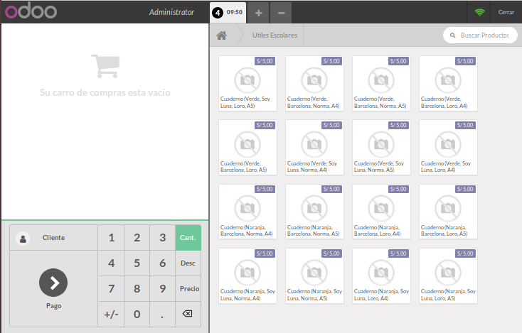
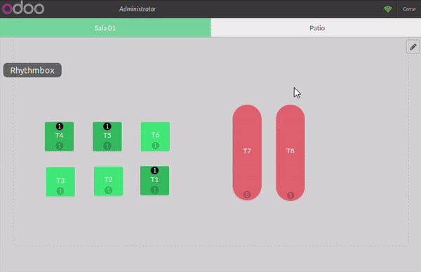
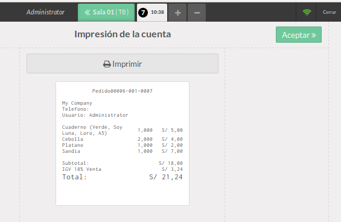

# Lab. 6: MÓDULO PUNTO DE VENTA EN ODOO

## Desarrollo

### 1. Instalación de Módulo Punto de Venta.
1.2. Instalamos el modulo de Punto de Venta

### 2. Funcionamiento del Punto de Venta

2.1. Diríjase al módulo Punto de Venta y haga click en Nueva Sesión.

2.2. La  interfaz de  venta  es relativamente fácil de utilizar. Automáticamente incluirá  todos  los  productosque ya hayamos registrado en el sistema

2.3.Podemos  incluso  elegir  entre  los  clientes  que  tengamos  ya  registrados  con  hacer  click  en  Cliente.

2.4. Así mismo, al dar click en el botón  Pago, encontraremos una interfaz sencilla,  donde elegiremos el medio   de   pago   y   demás   condiciones. Por   ahora   nos   aparecerásolamente   con   Efectivo (configuraremos más adelante otros medios comoVISA o MASTERCARD)

Inclusive, si seleccionamos una cantidad mayor, nos dirá el vuelto que tenemos que dar en efectivo, reduciendo así el margen de error humano.

2.5. Ingresado ya el medio de pago, de click en validar, aparecerá la impresión del ticket o comprobante de pago.

2.6. Vamosa dar click una vez en Cerrar y luego otra vez en Confirmar (esto evita que se cierre de manera accidental el punto de venta). Si nos dirigimos al listado de Sesiones y vemos la sesión actual veremos el total en efectivo de las transacciones del Punto de Venta. De esta manera tendremos un control de cierre de turno.Proceda a cerrar y validar esta sesión para iniciar otra con una nueva configuración.

### 3. Añadiendo control al POS.

3.1. Vamos a Configuración de Punto de Venta y seleccionamos el Punto de Venta Main (es el único que tenemos por el momento)

3.2. Habilite la opciónde Controlde Precios.

En la sección de Pagos, seleccione la opción Control de Efectivo. Esta permitirá declarar balances de apertura.En la sección de Métodos de Pago, haga click para agregar uno nuevo que se llamará VISA.

Este nuevo medio deberá ser de tipo Banco y tendrá como código corto VISA. Aproveche para crear uno similar que se utilice para MASTERCARD.

3.3. Intente iniciar  una  nueva  sesión  de  venta. Verá  que  ahora  no  lo  redirige  directamente  al  Punto  de Venta, sino que aparece una ventana previa. Aquí podrá configurar un Balance de Apertura.

El balance de Aperturase utiliza para declarar con cuanto trabaja inicialmente el cajero al comienzo del turno.Aquí se deberá ingresar todo el efectivo que se le entrega. Es una buena práctica entregar una cantidad estándar todos los días para facilitar este proceso.

Ingresemos las cantidades mostradas a continuación.

Veremos que el saldo solamente afecta anuestro diario Efectivo y no a los otros diarios.

Ahora sí, iniciaremos el Punto de Venta.Haga una venta que tenga dos medios de pago. Verá que Odoo  permite  pagar  de  distintas  formas,  conefectivo,  con  efectivo  y  otros  medios  combinado, solamente un medio bancarizado sin efectivo, etc. Añada imágenes de dichas ventas y comente las combinaciones que logró.

#### Primera combinación

#### Segunda combinación

#### Tercera combinación

3.5. Puede abrir otra pestaña del navegador para este paso. Fuera del Punto de Venta, proceda a crear un usuario adicional para el sistema con el nombre cajero y los permisos mostrados a continuación.

3.6. Aproveche para editar el usuario Administrador. En la pestaña Punto de Venta, proceda a introducir un PIN de seguridad.La opción de Código de barras es equivalente, pero funciona cuando utilizamos una tarjeta con código de identificación y un lector de la misma.

3.7. En la parte superior del Punto de Venta (ingrese de nuevo o refresque la ventana con F5)haga click en el nombredel usuario(Administradoro el nombre que le haya colocado)y vera una ventana de selección de usuario. Adjunte dicha imagen.Ahora, elija al usuario cajero  y  vea como se bloquea  la opción Precio. Solamente un  administrador puede modificar precios con la opción habilitada Control de precios.

3.8. Intente  acceder  como  Administrador.  Verá  que  le  solicita  una  contraseña,  que  justamente  será  lamisma  que  colocamos  en  pasos  anteriores. Verifique  que  ahora  se  habilite  el  botón  de  modificar precios.

### 4. Categorías de Productos

4.1. En el backend del sistema, vamos a Categorías de PDV.

4.2. Proceda a crear dos categorías:
- Frutas
- Útiles Escolares.

4.3. Vamos a editar un producto. En la pestaña Ventas, aparecerá la opción Punto de Venta. Dentro de ella, selecciona una de las dos categorías creadas. Repita esto con al menos 10 productos.

4.4. Refresque el Punto de Venta y vea como ahora se agregan las categorías creadas.

Al hacer click en una de ellas, inmediatamente se procede a filtrar solamente los productos de la misma.

4.5. Al hacer click en una de ellas, inmediatamente se procede a filtrar solamente los productos de la misma.

### 5. Configuración de restaurant.

5.1. Crearemos un nuevo punto de venta llamado Cafetería.

En  tipo  de  Operación  seleccionaremos  Pedidos  de  PdV  y  ubicaciónWH/Stock. Fíjese  que  aquí  se podría seleccionar otro almacén para poder así configurar una tienda físicamente distinta.

Seleccionaremos la opción Es un bar/restaurante.En caso usted tenga un botón Guardar, dele click.

Posteriormente, volvamos a editar y se debe seleccionar Gestión de Mesa y Notas de línea de pedido.

5.2. Al entrar en la opción Diseño del Piso, crearemos dos pisos tal cual está indicado.

5.3. Fíjese que ahora tenemos dos puntos de venta según lo configurado. Sin embargo al intentar iniciar sesión en nuestro nuevo punto de venta, tendremos un error.

Esto se debe a que solamente se puede tener una sesión de punto de venta activa por usuario.

Intente cerrar la sesión que utilizamos antes. Debería así mismo tener otro error.

Esto se debe a que,al crear una sesión con control de efectivo, nos pedirá al finalizar que declaremos cuanto efectivo tenemos, es decir, cuantas monedas, cuantos billetes y de que denominación son.Esta es una práctica muy común en supermercados y bancos para una doble validación, tanto de las transacciones registradas por el sistema como para verificar que el cajero tiene todo en orden.Puede haber ocasiones en que se toma dinero del Punto de Venta y se agrega (por ejemplo, por falta de sencillo)y esto se debe regularizar. Adjunte imágenes de agregar y sacar dinero.Ahora  establezcamos  el  Balance  de  cierre. Verá  que  nos  aparece  una  venta  idéntica  al  Balance  de apertura. Ingrese todo lo necesario para cuadrar con lo vendido.Deberá obtener una diferencia de 0.00

5.4. Ahora sí, ingrese al nuevo punto de venta. Verá las opciones de los pisos creados. 
Hagamos click en el  lápiz  ubicado  a  la  derecha.Este  nos  servirá  para  dibujar  las mesas  del  restaurante.  Proceda  a dibujarlas.

Verá que esta herramienta es muy útil y fácil de usar. Las mesas pueden tener nombres simples (como T1 o T2)o complejos, como Barra o VIP. Así mismo, el número de personas puede ser marcado, para que el mesero pueda acomodar a los clientes de acuerdo al tamaño del grupo. Se pueden cambiar las formase incluso modificar  colores.  Dibuje  las  mesas  de  ambos  pisos. Para  salir  del  modo  edición,  simplemente  de  click nuevamente en el lápiz de edición.

5.5. Para hacer un pedido, debemos estar fuera del modo de edición y hacer click en una mesa.

Para volver a la vista de mesas, haga click en la parte superior donde está el nombre del piso. Verá que ahora la mesa indica el número de pedidos que tiene en ejecución.Se puede volver en cualquier momento a dicha mesa y modificar el pedido.Adjunte un GIF mostrando el manejo de pedidos en al menos tres mesasy que sucede al cobrar uno totalmente.

5.6. Tenemos  un  nuevo  botón,  que  sirve  para  añadir  notas  a  los  pedidos.Así  se  le  pueden  añadir personalizaciones al pedido, como por ejemplo añadir mayonesa o preparar sin sal.

5.7. También tenemos un botón de Transferir que sirve para mover el pedido de una mesa a otra.

5.8. Volvamos a la configuración del Punto de Venta. Habilitemos la Impresión de cuenta y la separación de cuentas.

5.9. Ahora tenemos el botón Recibo,que sirve para imprimir la pre-cuenta (o llamada también comanda). Esto es útil para cuando los clientespiden el total para saber cuántohan consumido.

De igual manera,se habilitó el botón Dividir, que sirve para poder dividir el pago del consumo de la cuenta. De esta forma, se puede tomar el pedido de varias personas en una sola mesa y luego pagar y emitir comprobantes de pago por separado

## TAREA

Instala y usa el modulo pos_loyalty (se adjuntan GIFs del funcionamiento).

## OBSERVACIONES

- Al momento de instalar el modulo de Punto de Venta, por defecto se instalan Inventario y esto es porque punto de venta necesita una lista de productos para realizar sus operaciones, dicha lista la gestiona el modulo de Inventarios.
- Al momento de seleccionar el pago aun podemos cambiar de cliente y esto es bueno ya que puede que nos hayamos confundido de cliente y seria tedioso volver al menu donde se escojen los productos para volver a seleccionar el cliente.
- Al momento de entrar como desarrollador podemos ver que el menu se amplia, mostrando opciones mas avanzadas, como paso en Categorias de PdV.
- Existen modulos ya desarrollados en la pagina de Odoo Community, solo que para usarlos debemos de indicar la ruta en odoo.conf.
- Odoo ya calcula el vuelto, es muy eficiente para los cajeros, ya que es tedioso hacer un cierre de caja, t

## CONCLUSIONES

- Odoo POS está basado en una interfaz inteligente que cualquier empresa minorista puede utilizar sin ninguna dificultad.

- Odoo POS esta integrado con los modulos de Ventas, Inventario, Comercio electronico, etc.

- Podemos seguir realizando ventas, aunque no tengamos conexion, estas ventas se almecenan de en una DB provisional, una vez que recuperemos la conexion podremos actualizar esos cambios.

- Un Punto de Venta es muy similar a Ventas, pero ventas era mas para empresas grandes donde se puede llevar un seguimientos de las cotizaciones, email, etc.

- Podemos crear un restaurante dentro de PUNTO de VENTAS y modificar los asientos, las mesas, donde cada mesa tendra su pedido, tambien se logro agregar el modulo de pos, donde hay programas para el.