# Lab. 9: MÓDULO BASICO Y HERENCIA

## Desarrollo

### 3. Creacion del Modulo de Facturacion

3.7. Procederemosa reiniciar nuestro Odoo (si está en Windows,vaya a la consola de Servicios, en el caso de Linux, utilice sudo service odoo restart)para luego Actualizar la lista de aplicaciones (recuerde que esto debe ser hecho en modo desarrollador)y luego instalaremos nuestro módulo facturación.Lo reconocerá porque tendrá nuestro ícono declarado en el paso 3.1

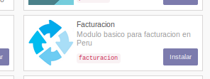

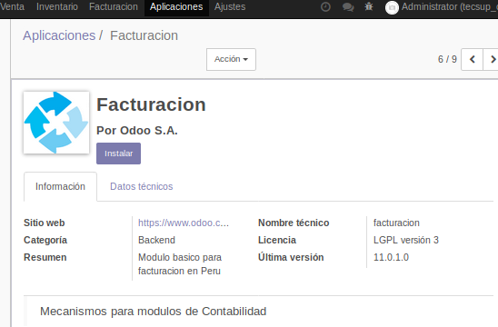

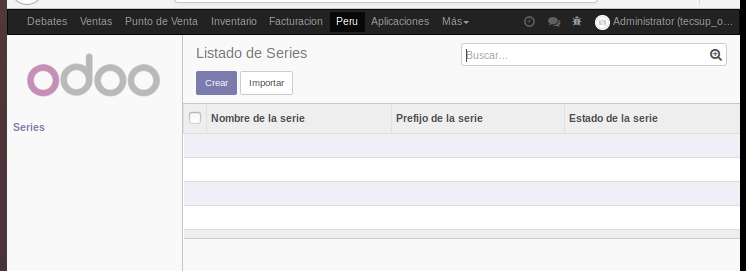

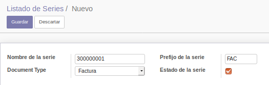

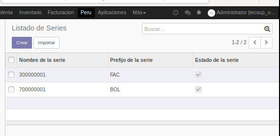

### 4. Vista de Formulario

4.2. Funcionamiento de nuestro listado con su nuevo formulario.

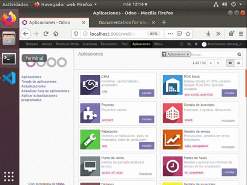

### 5. Vista de Busqueda

5.2. Adjuntaremos un GIF del funcionamientode nuestro listado con sunueva forma de búsqueda.

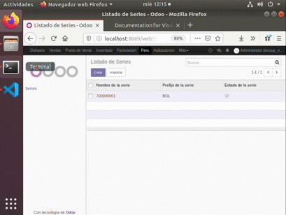

### 6. Data por defecto

6.3. Adjuntaremos una captura de la importación de nuestra data por defecto generada por el módulo.

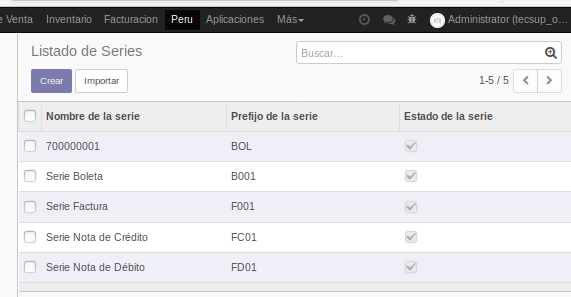

### 7.Verificación de API automática

7.3. Una vez creado el archivo, ejecutaremos node index.jsy adjunte un GIF de la ejecución de dicho comando. Deberíamos obtener los registros en dicho modelo, demostrando que Odoo ya crea una APIautomática para nuestros modelos con solamente declararlos.

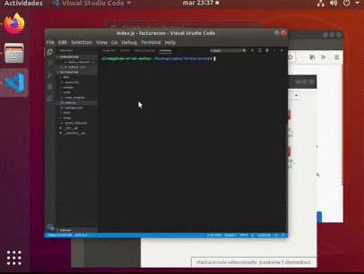

### 8.Herencia de modelos

8.5. Adjuntaremos unGIFde la vista de creación de facturas (Dentro del móduloFacturación, Ventas, Facturas de Cliente). Deberíamos ser capaces de relacionar nuestras series a las facturas ahora creadas.

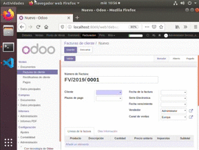

## TAREA

Deberá crear el modelo **facturacion.documentos**. Con data por defecto

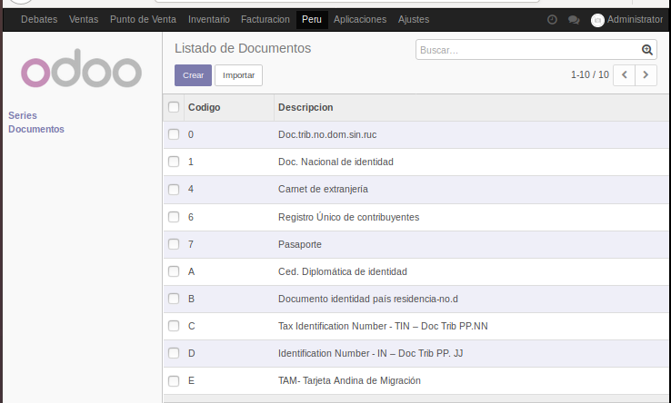

## OBSERVACIONES

- Es necesario crear los menuitems para ver los formularios y las listas

- Lo bueno de hacer herencias es que ya pide la data de otros modelos sin necesidad de hacer mas codigo.

- Se creo un modulo manualmente, ya que tambien se puede crear uno con scaffold.
