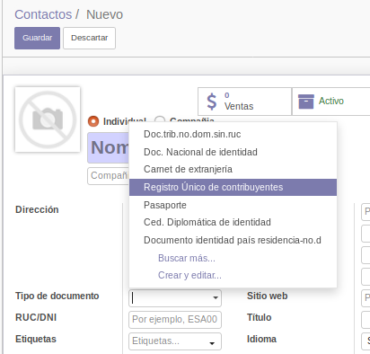

# Lab. 10: LLAMADAS A APIS EXTERNAS

## Desarrollo

### 2. Creacion del Modelo de Documentos

Adjunte  un  GIF  del  funcionamiento  de este nuevo menú Documentos, mostrando comose editaun ítemsin necesidad de abrir un formulario.

### 3. Relacion con Contactos

Adjunte una captura de cómose visualiza el nuevo campo al momento de crear un contacto.

### 4. Consumo de API externa

4.3.En nuestra bandeja, tendremos un correo de dicho servicio con un token. Conservaremos este token para nuestro consumo respectivo.

Reinicie el servicio.Ahora, intente crear o editar un contacto, luego adjunte una captura de loreflejado en el log de Odoo.

Adjunte un GIF mostrando como selecciona DNI e ingresa su DNI y hacer click fuera del campo, Odoo autocompleta su Nombre.

Adjunte un GIF mostrando como selecciona RUC e ingresa el RUC de la empresa Saga Falabella(debe googlear esta información)y lo que autocompleta Odoo.

### 5. Constraint o limitantes.

5.3. Adjunte un GIF mostrando dicha advertencia al intentar crear otra vez un contacto con su mismo DNI.

### 6.Campos relacionados

Adjunte un GIF mostrando el comportamiento de nuestro nuevo campo cuando, al crear una factura de Cliente, seleccionamos una serie de boleta o una serie de facturas.

## OBSERVACIONES Y CONCLUSIONES

- Nosotros podemos heredar vistas y modelos, para agregar campos, con la palabra _inherit

- Podemos editar directamente desde una lista sin neccesidad de acceder al formulario

- Podemos consumir una api externa, transformar esa data devuelta en JSON a datos para odoo.

- El metodo onchange tiene como parametros los campos que cambiaran para que se ejecute dicha funcion.

- Con Warning podremos lanzar una alerta (que no la vi tan amigable ya que sale como error, es como si fuera un error de codigo).

- Nosotros podemos modificar los atributos de algun campo, como por ejemplo el String, default, etc.
